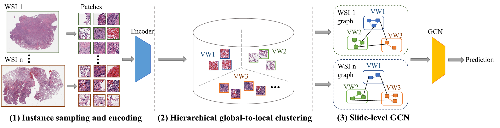
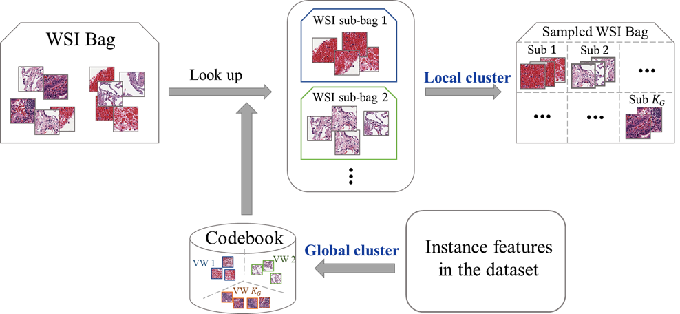

# NAGCN: Node-aligned Graph Convolutional Network for Whole-slide Image Representation and Classification (CVPR2022) 

## Abstract

> The large-scale whole-slide images (WSIs) facilitate the learning-based computational pathology methods. However, the gigapixel size of WSIs makes it hard to train a conventional model directly. Current approaches typically adopt multiple-instance learning (MIL) to tackle this problem. Among them, MIL combined with graph convolutional network (GCN) is a significant branch, where the sampled patches are regarded as the graph nodes to further discover their correlations. However, it is difficult to build correspondence across patches from different WSIs. Therefore, most methods have to perform non-ordered node pooling to generate the bag-level representation. Direct non-ordered pooling will lose much structural and contextual information, such as patch distribution and heterogeneous patterns, which is critical for WSI representation. In this paper, we propose a hierarchical global-to-local clustering strategy to build a Node-Aligned GCN (NAGCN) to represent WSI with rich local structural information as well as global distribution. We first deploy a global clustering operation based on the instance features in the dataset to build the correspondence across different WSIs. Then, we perform a local clustering-based sampling strategy to select typical instances belonging to each cluster within the WSI. Finally, we employ the graph convolution to obtain the representation. Since our graph construction strategy ensures the alignment among different WSIs, WSI-level representation can be easily generated and used for the subsequent classification. The experiment results on two cancer subtype classification datasets demonstrate our method achieves better performance compared with the state-of-the-art methods.





## Pre-requisites

* NumPy
* Pandas
* Scikit-learn
* Tqdm
* PyTorch
* PyTorch Geometric
* tensorboardX

## Data Preparation

First, download [TCGA data](https://www.cancer.gov/tcga). You need to cut whole-slide images (WSIs) into patches (e.g. size $256\times 256$ at $20\times$ magnification) , and then generate the instance-level features using an encoder network. The instance-level features of each WSI are used to generate the WSI bag. Each WSI bag is stored as a `.pt` file.

After that you need to generate an index file (in `.pth` format), which stores a python `list`, and each item of the list is a `dict`, which corresponds to one WSI information.

```python
[{'slide': 'xxx.pt', 'shape': torch.Size([N, D]), 'target': 'y'}]
```

* slide: the file of WSI bag
* shape: the size of WSI bag
* target: the label string of WSI


## Clustering Sampling

Perform hierarchical global-to-local sampling strategy to build visual codebook and generate the sampled WSI bags.

```shell
$ python codebook_generation.py
```


## Graph Construction

Construct WSI graphs using the sampled WSI bags.

```shell
$ python graph_construction.py
```


## Experiment on TCGA Dataset

```shell
$ CUDA_VISIBLE_DEVICES=0 python main_nsclc.py 
```

Keep updating...

***


## Citation

If you want to cite this work, please use the following BibTeX entry.

```latex
@InProceedings{Guan_2022_CVPR,
    author    = {Guan, Yonghang and Zhang, Jun and Tian, Kuan and Yang, Sen and Dong, Pei and Xiang, Jinxi and Yang, Wei and Huang, Junzhou and Zhang, Yuyao and Han, Xiao},
    title     = {Node-Aligned Graph Convolutional Network for Whole-Slide Image Representation and Classification},
    booktitle = {Proceedings of the IEEE/CVF Conference on Computer Vision and Pattern Recognition (CVPR)},
    month     = {June},
    year      = {2022},
    pages     = {18813-18823}
}
```

